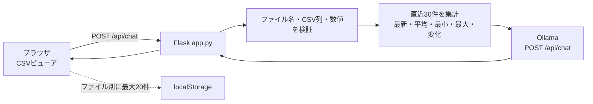

# CSV ビューア AI チャット機能 説明書

## 1. 概要

CSV ビューア右下の「AI分析」から、選択中のセンサー CSV について質問できます。
Flask アプリが CSV の直近最大30件を検証・集計し、その結果と会話履歴をローカルの
Ollama Chat API へ送ります。既定モデルは `gemma3:4b` です。

AIチャット用の別Webサーバーはありません。CSV表示とチャットAPIを
`Server/app.py` の1プロセス、同じオリジンで提供するため、CORS設定も不要です。



## 2. 主な実装ファイル

| ファイル | 役割 |
| --- | --- |
| `Server/app.py` | CSVビューアと `POST /api/chat` を提供し、入力検証とHTTPエラー変換を行う |
| `Server/ai_chatbot.py` | CSV読込、列名解決、直近30件の集計、プロンプト生成、Ollama通信を行う |
| `Server/templates/index.html` | チャットパネル、入力欄、履歴削除ボタンを定義する |
| `Server/static/script.js` | パネル操作、API通信、会話履歴の保存・復元を行う |
| `Server/static/style.css` | PC・スマートフォン向けのチャットUIを定義する |
| `tests/unit/test_ai_chatbot.py` | CSV互換性、パス検証、プロンプト、Ollamaエラーを検証する |
| `tests/unit/test_app.py` | チャットAPIの入力、成功応答、HTTPステータスを検証する |
| `tests/e2e/test_csv_viewer.py` | ブラウザ上の送信、回答表示、履歴削除を検証する |

既存の `Server/chatbot.py` はルールベースのサンプルとして残してあります。
WebブラウザのAIチャットが使用するのは `Server/ai_chatbot.py` です。

## 3. CSVの扱い

温度と湿度は必須です。時刻、クライアントID、CO2、光量は任意で、存在する値だけを
AIへ渡します。

| 意味 | 対応する列名 | 必須 |
| --- | --- | --- |
| 温度 | `temp`, `temperature`, `温度`, `室温` | はい |
| 湿度 | `humid`, `humidity`, `湿度` | はい |
| 時刻 | `timestamp`, `datetime`, `time`, `日時`, `時刻` | いいえ |
| クライアントID | `client_id`, `client`, `端末id`, `クライアントid` | いいえ |
| CO2 | `co2`, `co2_ppm`, `二酸化炭素` | いいえ |
| 光量 | `light_percent`, `light`, `lux`, `照度`, `光量` | いいえ |

次の両方を分析できます。

```csv
id,timestamp,temp,humid
0,2026-07-24 10:00:00,25.1,52.0
```

```csv
id,client_id,timestamp,temp,humid,co2,light_percent
0,raspi-lab,2026-07-24 10:00:00,25.1,52.0,850,43.0
```

ファイル名は `Server/data/data-*.csv` に限定しています。`../` や絶対パスを使った
データディレクトリ外へのアクセスは拒否します。空欄や数値でない必須センサー値が
含まれる場合も、誤った集計をせずエラーを返します。

## 4. セットアップと起動

### 4.1 Python依存関係

```bash
cd Server
python3 -m pip install -r requirements.txt
```

### 4.2 Ollamaモデル

Ollamaをインストールし、既定モデルを取得します。

```bash
ollama pull gemma3:4b
```

OllamaのAPIが起動していることは、次のコマンドで確認できます。

```bash
curl http://127.0.0.1:11434/api/tags
```

Ollamaの既定APIは `http://localhost:11434/api` で、チャット生成には
`POST /api/chat` を使用します。モデル名と利用可能なタグは
[Ollama Chat API](https://docs.ollama.com/api/chat) および
[Gemma 3モデル一覧](https://ollama.com/library/gemma3) を参照してください。

### 4.3 Flaskアプリ

```bash
cd Server
python3 app.py
```

ブラウザで `http://127.0.0.1:5001/` を開きます。CSVを選び、右下の
「AI分析」を押して質問します。Enterで送信、Shift+Enterで改行できます。

## 5. 設定

環境変数でモデルとOllamaの接続先を変更できます。

| 環境変数 | 既定値 | 説明 |
| --- | --- | --- |
| `OLLAMA_MODEL` | `gemma3:4b` | Ollamaへ渡すモデル名 |
| `OLLAMA_URL` | `http://127.0.0.1:11434/api/chat` | Chat APIの完全なURL |

例:

```bash
cd Server
OLLAMA_MODEL=gemma3:1b \
OLLAMA_URL=http://127.0.0.1:11434/api/chat \
python3 app.py
```

## 6. API仕様

### `POST /api/chat`

リクエスト例:

```json
{
  "message": "最近、温度が上がった原因は？",
  "file": "data-20260724100000.csv",
  "conversation": [
    {"role": "user", "content": "現在の状態は？"},
    {"role": "assistant", "content": "最新温度は25.1℃です。"}
  ]
}
```

- `message` は必須で、空白のみは不可、最大1000文字です。
- `file` は画面に表示される `data-*.csv` のいずれかです。省略時は最新ファイルです。
- `conversation` は任意です。サーバーは末尾10件だけを採用し、`user` と
  `assistant` 以外のロールを破棄します。

成功応答:

```json
{
  "response": "結論: 直近30件では温度が2.4℃上昇しています。…",
  "selected_file": "data-20260724100000.csv"
}
```

| HTTP | 主な原因 |
| --- | --- |
| `400` | 質問が空、または1000文字超過 |
| `404` | 指定CSVが存在しない |
| `422` | 必須列不足、空データ、数値形式不正 |
| `502` | OllamaがHTTPエラー、不正形式、空回答を返した |
| `503` | Ollamaへ接続できない、またはタイムアウト |

## 7. 会話履歴とデータ範囲

- ブラウザは会話をCSVファイル別に `localStorage` へ最大20件保存します。
- 「履歴削除」は選択中CSVの履歴だけを削除します。
- APIへ送る会話履歴は直近10件です。
- CSVはファイル末尾の最大30行を分析します。
- AIへ渡す集計は、最新値、平均、最小、最大、区間の先頭から末尾までの変化です。
- 回答は生成AIによるため毎回完全には一致しません。システムプロンプトで
  CSVにない情報を断定しないよう指示していますが、重要な判断は元CSVも確認してください。

既定設定ではCSV内容はローカルOllamaへ送られます。`OLLAMA_URL` を別ホストへ変更した
場合は、その接続先へ最大30件のセンサーデータと会話履歴が送られる点に注意してください。

## 8. 自動テスト

単体テスト:

```bash
python3 -m unittest discover -s tests/unit -p "test_*.py" -v
```

ブラウザE2E:

```bash
python3 -m pip install -r tests/requirements.txt
python3 -m playwright install chromium
python3 -m pytest tests/e2e -v
```

E2EではOllamaを起動せず、ブラウザからの `/api/chat` 通信をモックします。実際の
モデルを含む手動確認では、OllamaとFlaskを起動して次を確認してください。

1. 「AI分析」を開ける。
2. 質問、選択中ファイル名、会話履歴が `/api/chat` へ送られる。
3. 回答がチャット欄へ表示される。
4. ページ再読み込み後も、同じCSVの履歴が復元される。
5. 「履歴削除」で、選択中CSVの履歴だけが消える。

## 9. トラブルシューティング

### 「Ollamaへ接続できません。」

Ollamaが起動しているか、`OLLAMA_URL` が完全なChat API URLかを確認します。

```bash
curl http://127.0.0.1:11434/api/tags
```

### 「Ollama APIがエラーを返しました（HTTP 404）。」

指定モデルが取得済みか確認し、なければ取得します。

```bash
ollama pull gemma3:4b
```

### 「AI分析に必要な列がありません」

CSVに温度列と湿度列があるか、対応する列名になっているかを確認します。

### 古い回答履歴が表示される

選択中CSVの「履歴削除」を押します。履歴はCSVファイル名ごとに分離されています。
